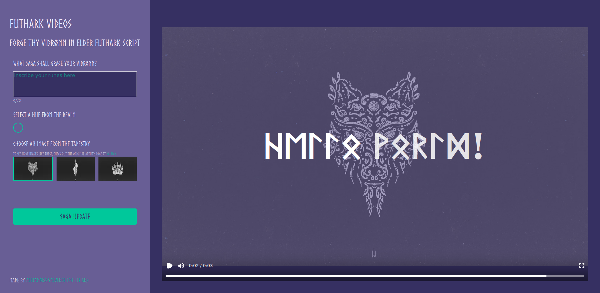

# Futhark-Video: A Saga of Runic Elegance

Hail, warriors and skalds! Behold, Futhark-Video, a netrūn that melds the ancient wisdom of runic script with the prowess of modern video craft. Forged in the fires of Next.js and Remotion, this project weaves letters into the sacred Futhark, breathing life into dynamic videos that resonate with the echoes of our Nordic ancestors.

## How to use

Just input the text you want the video to display in the text box, select a color, and select one of the three preloaded images. Then, click the button to generate the video!

<!-- insert image from image folder -->

## The runes

Runes are letters native from the germanic languages. In this project, I am using the Elder Futhark, which is the oldest form of runic script. The Elder Futhark consists of 24 runes, each with a name and a phonetic value. The runes are divided into three groups of eight, called ættir. Each ættir is associated with a Norse god, and each rune is associated with a concept. The three ættir are as follows:

* Freyr's ættir: Fehu (ᚠ), Uruz (ᚢ), Thurisaz (ᚦ), Ansuz (ᚨ), Raidho (ᚱ), Kenaz (ᚲ), Gebo (ᚷ), Wunjo (ᚹ)
* Hagal's ættir: Hagalaz (ᚺ), Nauthiz (ᚾ), Isa (ᛁ), Jera (ᛃ), Eihwaz (ᛇ), Perthro (ᛈ), Algiz (ᛉ), Sowilo (ᛊ)
* Tyr's ættir: Tiwaz (ᛏ), Berkano (ᛒ), Ehwaz (ᛖ), Mannaz (ᛗ), Laguz (ᛚ), Ingwaz (ᛜ), Dagaz (ᛞ), Othala (ᛟ)

I am no expert in runes, but I have done my best to make sure that the runes are used correctly. If you notice any mistakes, please let me know!

To learn more about runes, check out the main wikipedia article on runes [here](https://en.wikipedia.org/wiki/Runes), or the main on elder futhark [here](https://en.wikipedia.org/wiki/Elder_Futhark).

One page I specially like (the one from where the images are taken) is [valhyr](https://valhyr.com/). It has a lot of information about runes, and it also has a rune converter, which is very useful to check if the runes are being used correctly. They also have very cool arts, cool merch, and a cool instagram page. Check them out!
 

### Disclaimer

Work in Progress: The longship is still under construction! Stay tuned for the grand unveiling of Netrūn, our digital hall where the runes of the modern age come to life! Skål! 🍻